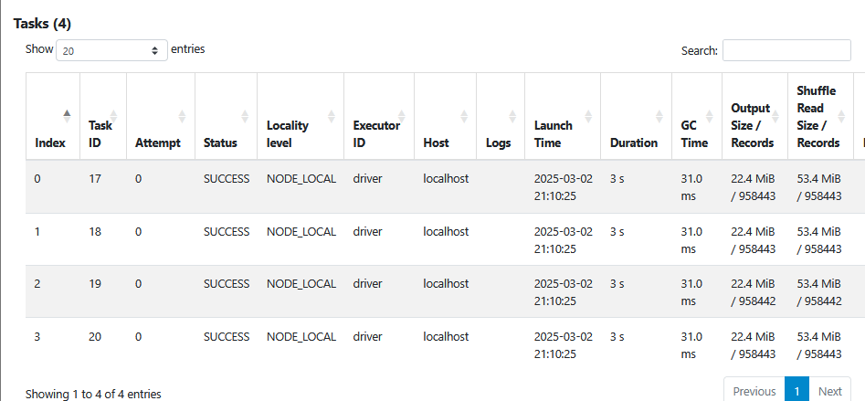
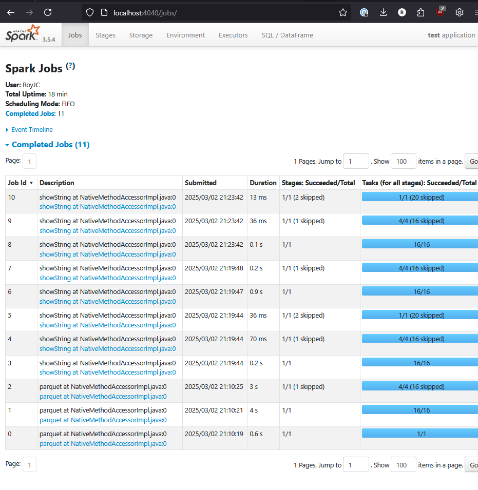

#Question 1: Install Spark and PySpark
    Run PySpark
    Create a local spark session
    Execute spark.version.
What's the output?

ANSWER: Spark Version 3.3.2

- I know the version is supposed to be 3.3.2, because the installation files for Spark are pulled from prior version when its downloaded ( https://archive.apache.org/dist/spark/spark-3.3.2/spark-3.3.2-bin-hadoop3.tgz) but I ran into installation issues and Spark would not run on my local machine, so I downloaded version 3.5.4 from the Spark website. And my homework.ipynb notebook is utilizing spark version 3.5.4
from pyspark.sql import SparkSession
spark = SparkSession.builder \
    .master("local[*]") \
    .appName('test') \
    .getOrCreate()
print(spark.version) == 3.5.4

#Question 2: Yellow October 2024
Read the October 2024 Yellow into a Spark Dataframe. Repartition the Dataframe to 4 partitions and save it to parquet.

What is the average size of the Parquet (ending with .parquet extension) Files that were created (in MB)? Select the answer which most closely matches.

import pyspark
from pyspark.sql import SparkSession

spark = SparkSession.builder \
    .master("local[*]") \
    .appName('test') \
    .getOrCreate()

input_path = 'C:/Tools/tmp/data/raw/yellow/2024/10/yellow_tripdata_2024-10.parquet'

df = spark.read.parquet(input_path)
df = df.repartition(4)

output_path = 'C:/Tools/tmp/homework/2'

df.write.mode("overwrite").parquet(output_path)

ANSWER: ~25MB

#Question 3: Count records
How many taxi trips were there on the 15th of October?
Consider only trips that started on the 15th of October.

df.registerTempTable('trips_data')  

spark.sql("""

SELECT count(1) FROM trips_data 
WHERE DATE(tpep_pickup_datetime) = '2024-10-15';
""").show()

C:\tools\spark-3.5.4-bin-hadoop3\python\pyspark\sql\dataframe.py:329: FutureWarning: Deprecated in 2.0, use createOrReplaceTempView instead.
  warnings.warn("Deprecated in 2.0, use createOrReplaceTempView instead.", FutureWarning)
+--------+
|count(1)|
+--------+
|  128893|
+--------+
ANSWER: 128893

? - 

#Question 4: Longest trip
What is the length of the longest trip in the dataset in hours?

spark.sql("""
SELECT 
    (unix_timestamp(tpep_dropoff_datetime) - unix_timestamp(tpep_pickup_datetime)) / 3600 AS trip_duration
FROM trips_data
ORDER BY trip_duration DESC
LIMIT 10;
""").show()                 

+------------------+
|     trip_duration|
+------------------+
|162.61777777777777|
|           143.325|
|137.76055555555556|
|114.83472222222223|
| 89.89833333333333|
| 89.44611111111111|
| 70.29916666666666|
| 67.57333333333334|
| 66.06666666666666|
|           46.4225|
+------------------+

ANSWER: 162.6177777777

#Question 5: User Interface
Spark’s User Interface which shows the application's dashboard runs on which local port?

ANSWER: 4040

#Question 6: Question 6: Least frequent pickup location zone
Using the zone lookup data and the Yellow October 2024 data, what is the name of the LEAST frequent pickup location Zone?

lookup_df = spark.read.option("header", "true").csv('taxi_zone_lookup.csv')

lookup_df.registerTempTable('lookup')  

spark.sql("""

SELECT lookup.Zone , count(1) as num_trips FROM trips_data 
INNER JOIN lookup ON lookup.LocationID = trips_data.PULocationID
GROUP BY lookup.Zone
ORDER BY num_trips ASC;
""").show()  

+--------------------+---------+
|                Zone|num_trips|
+--------------------+---------+
|Governor's Island...|        1|
|       Rikers Island|        2|
|       Arden Heights|        2|
|         Jamaica Bay|        3|
| Green-Wood Cemetery|        3|
|Charleston/Totten...|        4|
|   Rossville/Woodrow|        4|
|       Port Richmond|        4|
|Eltingville/Annad...|        4|
|       West Brighton|        4|
|         Great Kills|        6|
|        Crotona Park|        6|
|Heartland Village...|        7|
|     Mariners Harbor|        7|
|Saint George/New ...|        9|
|             Oakwood|        9|
|       Broad Channel|       10|
|New Dorp/Midland ...|       10|
|         Westerleigh|       12|
|     Pelham Bay Park|       12|
+--------------------+---------+
only showing top 20 rows

ANSWER: Governor's Island....